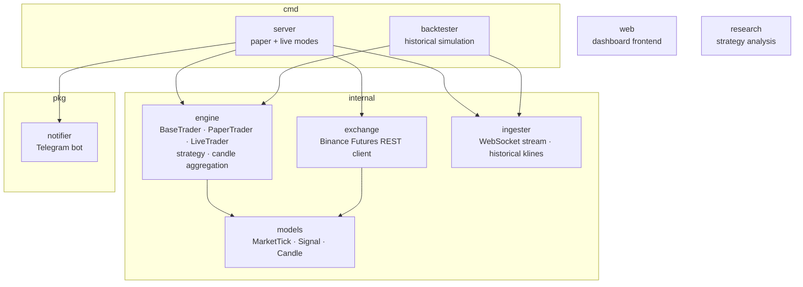
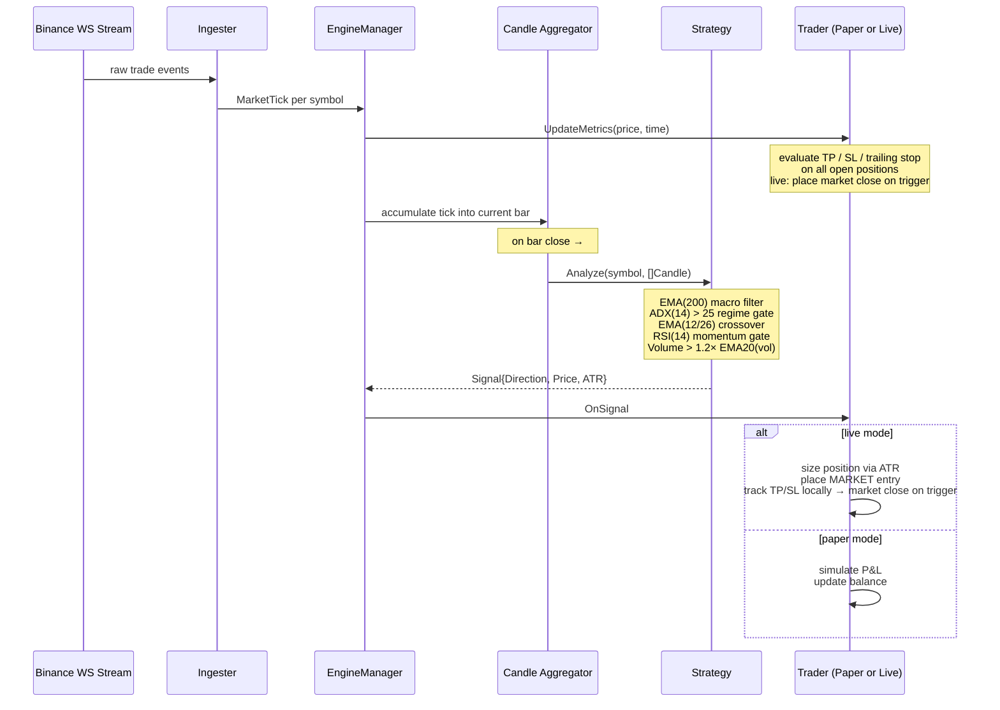

# Kryptic Gopha

A concurrent algorithmic trading engine written in Go, targeting Binance USDT-M Perpetual Futures. Supports paper trading (simulation against live market data) and live execution on Binance Futures Testnet or production, controlled via a web dashboard and Telegram bot.

Currently running live on **Binance Futures Testnet** with 10× leverage across BTCUSDT, ETHUSDT, SOLUSDT, and BNBUSDT.

---

## Architecture



### Data Flow



---

## Engine Design: BaseTrader

All shared trading logic lives in `internal/engine/base_trader.go`. Both `PaperTrader` and `LiveTrader` embed `BaseTrader` and only implement their specific execution paths. This eliminates code duplication and ensures both modes behave identically for:

- Position sizing (`computeEntrySize` — ATR-based or fixed-% fallback, with notional cap)
- Exit evaluation (`evaluateExits` — TP, ATR/fixed SL, trailing SL, time exit)
- Risk accounting (`recordClose`, daily PnL tracking, circuit breaker)
- State persistence (`saveState` / `loadState`)

```
BaseTrader
├── PaperTrader  — simulates fills at signal price; no real orders
└── LiveTrader   — places MARKET orders on Binance; local exit tracking
```

---

## Strategy

The production strategy (`EfficientMultiFactorStrategy`) applies five sequential filters. All conditions must pass for an entry.

**Long entry conditions (short mirrors each with reversed comparisons):**

| # | Filter | Condition | Purpose |
|---|---|---|---|
| 1 | Macro trend | `close > EMA(200)` | Align with dominant directional bias |
| 2 | ADX regime gate | `ADX(14) > 25` | Confirm a trending market; suppress EMA noise in ranging conditions |
| 3 | Entry trigger | `EMA(12) > EMA(26)` | MACD-equivalent crossover in trend direction |
| 4 | Momentum gate | `RSI(14) < 70` | Avoid entering near exhaustion |
| 5 | Volume confirmation | `bar_volume > 1.2 × EMA20(volume)` | Require above-average participation behind the move |

**Signal output** includes `ATR(14)` in price units, which the trader uses for dynamic position sizing and stop-loss placement.

**Indicator computation** — all indicators are maintained incrementally using Wilder's exponential smoothing (O(1) per bar). State is seeded on startup by fetching 250 historical 1-minute klines from the Binance REST API (250 bars required for EMA(200) warmup).

See [research/hft_analysis.md](research/hft_analysis.md) for a detailed quantitative assessment and improvement roadmap.

---

## Risk Management

| Parameter | Paper Default | Live Default | Environment Variable |
|---|---|---|---|
| Take-profit | 0.5% | 0.5% | `TP` |
| Stop-loss (fixed fallback) | 0.3% | 0.3% | `SL` |
| Dynamic stop-loss | 1.5 × ATR(14) | 1.5 × ATR(14) | — (automatic when ATR available) |
| Trailing SL | enabled | enabled | `TRAILING_SL` |
| Trailing SL distance | 0.3% | 0.3% | `TRAILING_SL_PCT` |
| Max position size | 20% of balance | 20% of balance | — (hardcoded cap) |
| Risk per trade | 1% of balance | 1% of balance | `RISK_PER_TRADE` |
| Daily loss limit | 5% | 5% | `DAILY_LOSS_LIMIT` |
| Max open trades | 5 | 5 | `MAX_OPEN_TRADES` |
| Leverage (live only) | — | 10× | `LEVERAGE` |

**Position sizing** — when `Signal.ATR > 0`:
```
qty = (balance × RISK_PER_TRADE) / (1.5 × ATR)
```
Capped so that `qty × price ≤ balance × 0.20` (20% of balance max per trade). Falls back to `(balance × RISK_PER_TRADE) / (price × SL)` when ATR is unavailable.

**Exit management** — TP, SL, trailing SL, and a 10-minute time exit are all tracked locally in real-time by `UpdateMetrics`. On the live trader, when any exit condition triggers, a `MARKET` close order is placed immediately. No exchange bracket orders (STOP_MARKET / TAKE_PROFIT_MARKET) are used — Binance Futures rejects these at `/fapi/v1/order` in some environments (`-4120`).

**Circuit breaker** — suspends all new entries when daily PnL falls below `DAILY_LOSS_LIMIT`. Resets automatically at calendar day rollover or via the `/resume` Telegram command.

---

## Binance Testnet Setup

To run against Binance Futures Testnet:

1. Create a testnet account and generate API keys at [testnet.binancefuture.com](https://testnet.binancefuture.com)
2. Set in `.env`:
```env
TRADING_MODE=live
BINANCE_TESTNET=true
BINANCE_API_KEY=<testnet_key>
BINANCE_API_SECRET=<testnet_secret>
LEVERAGE=10
```
3. The bot automatically sets leverage for each symbol on startup and syncs balance from Binance.

Testnet uses:
- REST: `https://testnet.binancefuture.com`
- WebSocket: `wss://stream.binancefuture.com`

---

## Configuration

Copy `.env.example` to `.env` and configure before running.

```env
# Watchlist: comma-separated Binance USDT-M Futures symbols
WATCHLIST=BTCUSDT,ETHUSDT,SOLUSDT,BNBUSDT

# Strategy periods
SHORT_PERIOD=12
LONG_PERIOD=26
RSI_PERIOD=14
BAR_INTERVAL_SECONDS=60

# Risk management
INITIAL_BALANCE=10000.0
TP=0.005
SL=0.003
TRAILING_SL=true
TRAILING_SL_PCT=0.003
RISK_PER_TRADE=0.01
DAILY_LOSS_LIMIT=0.05
MAX_OPEN_TRADES=5

# Trading mode: paper | live
TRADING_MODE=paper

# Binance Futures Testnet (requires TRADING_MODE=live)
BINANCE_TESTNET=false
LEVERAGE=10

# Binance API credentials (required for TRADING_MODE=live)
BINANCE_API_KEY=
BINANCE_API_SECRET=

# Telegram notifications (optional)
TELEGRAM_BOT_TOKEN=
TELEGRAM_CHAT_ID=

# Server
PORT=8080
ENV=dev    # dev = human-readable logs; omit for JSON logs
```

---

## Running

**Paper trading:**
```bash
cp .env.example .env
# edit .env — set TRADING_MODE=paper
go run cmd/server/main.go
```

**Live on testnet:**
```bash
# edit .env — set TRADING_MODE=live, BINANCE_TESTNET=true, add testnet API keys
go run cmd/server/main.go
```

**Live on production:**
```bash
# edit .env — set TRADING_MODE=live, BINANCE_TESTNET=false, add production API keys
go run cmd/server/main.go
```

**Docker:**
```bash
docker build -t kryptic-gopha .
docker run --env-file .env -p 8080:8080 kryptic-gopha
```

**Backtester:**
```bash
go run cmd/backtester/main.go -symbol BTCUSDT -interval 1m -limit 500
```

---

## API Endpoints

| Method | Path | Description |
|---|---|---|
| GET | `/health` | Bot status, win rate, active trade count |
| GET | `/api/state` | Full trader state snapshot |
| GET | `/api/trades` | Active and completed trades |
| GET | `/api/signals?symbol=BTCUSDT` | Recent signal history for a symbol |
| GET | `/api/candles?symbol=BTCUSDT` | OHLCV history + current forming bar |
| GET | `/` | Web dashboard |

---

## Telegram Commands

| Command | Description |
|---|---|
| `/status` | Balance, daily PnL, active trade count |
| `/stop` | Suspend all new entries |
| `/resume` | Re-enable trading (clears circuit breaker) |
| `/setbalance <amount>` | Update trading capital |
| `/help` | Command list |

---

## Development

```bash
# Run tests
go test ./...

# Run with race detector
go test -race ./...

# Build binary
go build -o bin/kryptic-gopha ./cmd/server
```

---

## Disclaimer

This software is a research and educational tool. Cryptocurrency trading involves substantial risk of loss. Nothing in this codebase constitutes financial advice. Use in live markets entirely at your own risk.
